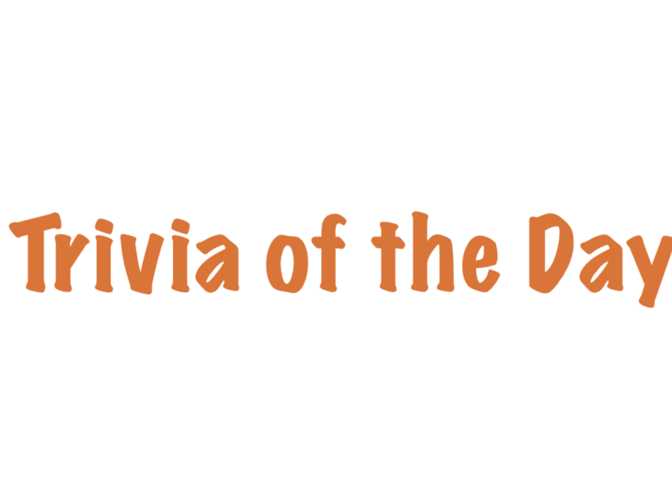

# Nickel Trivia

Nickel Trivia is a Trivia Game built for grandparents to play with their grandchildren. This user friendly App takes advantage of the OpenTrivia Database to populate the game with fun, and accessible trivia questions for users. Participants are awarded virtual nickels as points to keep score. The Landing Page directs users to two paths, a Question of the Day and a Group Trivia Game. In its current iteration, the game would best be faciliated by a leader in a group. In future iterations, the App will have multi-player options allowing friends and families to compete amongst each other. 

### Background/About

Nickel Trivia is an app that came out of a challenge. Both an API and a target user were drawn from a hat. This random pairing encouraged developers to pursue creative and unique approaches to create a product with the available resources that ultimately meets the end-users goals and draws in that target audience.

### API's used

* OpenTrivia DB API

### Primary JavaScript Technologies Used

* React.js
* Redux
* React Router

### Screenshots

#### Landing Page:


#### Trivia of the Day:



#### Trivia Game:


### Setup
#### Frontend

Clone the repo

Run ```npm install``` from the root directory

Run ```npm start``` and visit localhost:3000 in your browser

### Test Driven Development

Nickel Trivia uses Jest and Enzyme for frontend testing.

Run with ```npm test``` from the root directory

### Original Assignment

[Binary Challenge](http://frontend.turing.io/projects/binary-challenge.html) from the Turing School of Software & Design

### Contributors

* Tobin Nelson: [Github Profile](https://github.com/Tobin-jn)
